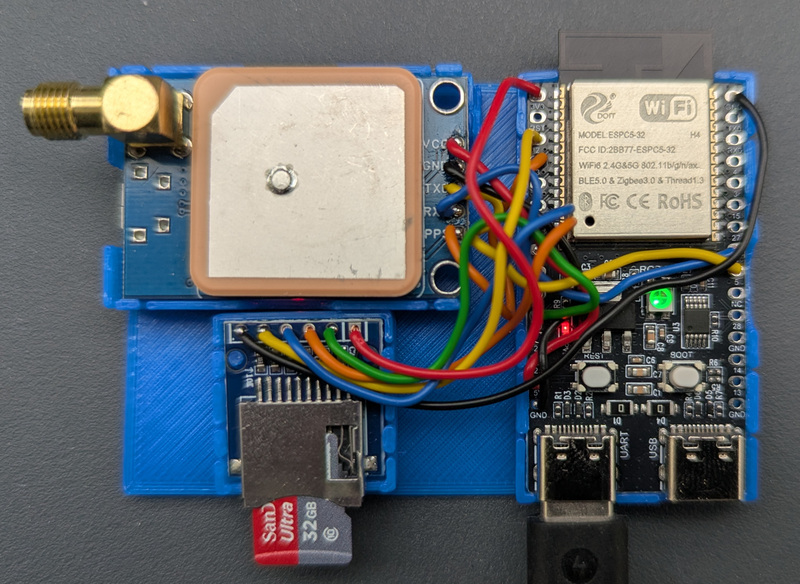

# ESP32-C5 ITS Logger

<a href="esp32-c5-its.jpg"></a>

Logger for Intelligent Transort Systems (ITS) G5 / IEEE 802.11p / V2X / Car2X messages at 5.9GHz.

Inspired by the [OpenTrafficMap](https://opentrafficmap.org/) project to use an ESP32-C5 outside its specs to log ITS messages. While OpenTrafficMap focuses on stationary measurement points to visualize traffic on a map, this project's focus is recording while moving.

A mobile phone can be used as power supply and to record the data via USB. With the optional SD card module as mass storrage a power bank is sufficient for operation.

Logged are the raw messages, decoding has to be done with other tools e.g. Wireshark or CANalyzer.Car2x. [ESP32-C5-ITS-Log](#esp32-c5-its-log) can be used as log file converter for those tools. With the optional GPS module UTC time and the own position are recoreded as well.

When connecting the receiver to a Raspi [ESP-C5-ITS-OTM](#esp32-c5-its-otm-open-traffic-map) can transmit the captured messages to Open Street Map.

Transmitting at 5.9GHz is illegal in most countries. As ITS messages are safety related and everybody should be safe, receiving and logging might be ok. Check yourself for your country and use it on your own risk.

## ESP32-C5-ITS-RX

ESP32-C5 firmware. Captures ITS messages and logs them to the Serial/JTAG USB (CDC/ACM) or an optional SD card.

The development environment is PlatformIO, use it to compile and upload. To enable 802.11p communication unofficial espidf framework functions are used, they might be removed in later versions of their IDE.

Logged are all received ITS messages and a timestamp/postion per second. If the optional GPS has a fix it's UTC time and position, else it's the ESP's system time.

### LED

The LED shows dim continuous light to indicate timestamp/position status

| mode         | continuous color |
| ------------ | -----------------|
| system time  | dim red          |
| GPS time     | dim blue         |
| GPS position | dim green        |

The LED flashes bright for each received ITS message and timestamp/position update.

| mode              | flash color  |
| ----------------- | ------------ |
| nothing connected | red          |
| usb connected     | yellow       |
| SD card logging   | blue         |
| usb & SD card     | green        |

### GPS (optional)

A GPS receiver can be connected for UTC time and position. The GPS module must provide a PPS signal.

| ESP32-C5 | GPS |
|----------|-----|
| GPIO 3   | PPS |
| GPIO 4   | RX  |
| GPIO 5   | TX  |

### SD Card (optional)

An SD card can be connected for logging data. Logging to SD card is started/stopped by pressing the ESP's boot button. The log filename is "log-timestamp.dat" with timestamp in seconds. Make sure to stop logging before switching off.

| ESP32-C5 | SD card |
|----------|---------|
| GPIO2    | MISO    |
| GPIO7    | MOSI    |
| GPIO6    | CLK     |
| GPIO10   | CS      |

## ESP32-C5-ITS-Log

Linux Converter for the recorded data, it converts to
- Wireshark PCAPNG: Generated file name is source name + ".pcapng" extension. Optional GPS data is added as a Beacon message with source address { 0xaa 0xaa 0xaa 0xaa 0xaa 0xaa }.
- CANoe/CANalyzer BLF: Generated file name is source name + ".blf" extension. Optional GPS data is added as GNSS system variable.

### Dependencies
 - [fpcap](https://github.com/fpcap/fpcap)
 - [Technica-Engineering vector_blf](https://github.com/Technica-Engineering/vector_blf)

### Compile
Download and compile fpcap and vector_blf libraries. Update the library paths in the Makefile and run make.

### Usage
```txt
usage: log-cvt [-p|-b] [-u] <log-file> ...
options:
  -p    pcapng file (default)
  -b    vector blf file
  -u    source is usb log with magic bytes (default sd log w/o magic bytes)
```

## ESP32-C5-ITS-OTM (Open Traffic Map)

Linux Client for Open Traffic Map. Connect the receiver to a Raspi and send captured messages to Open Traffic Map.
(Should work for all Linux systems, but could not reliably open /dev/ttyACM0 without running a monitor program first.)

### Dependencies
 - Mosquitto MQTT
```txt
apt install libmosquitto-dev libmosquittopp-dev libssl-dev
```
### Compile
```txt
make
```
### Usage
For a your individual OTM node id use option ```-mi```. The last 6 digits of the Linux machine id (/etc/machine-id) will be appended for uniqueness. If no ```-mt``` is given the topic path will be updated accordingly. E.g. ```-mi myNode``` will produce id ```myNode-ABCDEF``` and topic ```/its/myNode-ABCDEF/packet```.

```txt
usage: esp32-c5-its-otm [option] ...
options
  -t|--tty <device>         tty device (default /dev/ttyACM0)
  -mh|--mqtt-host <host>    mqtt host (default cits1.opentrafficmap.org)
  -mp|--mqtt-port <port>    mqtt port (default 8883)
  -mi|--mqtt-id <id>        mqtt id (default esp32-c5-its)
  -mt|--mqtt-topic <topic>  mqtt topic (default its/esp32-c5-its/packet)
  --tls                     tls (default)
  --tls-unsecure            tls but no verification
  --tls-off                 no tls
```

## Log File Format

Format is still in development, compatibility may break at any time.

Integer are stored little endian (ESP32 native).

```c
struct
{
  uint32_t magic;        // 0xAA5555AA -- only in usb log, missing in sd card log
  uint8_t  pkt_type;     // 1 ITS / 2 GPS
  uint64_t timestamp_us; // UTC time in µs after GPS fix, else ESP system time in µs
  uint16_t length;       // length of follwing data (varibiable for ITS, 13 for GPS)

  union
  {
    struct
    {
      uint8_t payload[length];
    } its;
    struct
    {
      uint8_t quality;
      int32_t latitude;   // °, * 10^7
      int32_t longitude;  // °, * 10^7
      int32_t altitude;   // m, * 10 
    } gps;
  };
} 
```